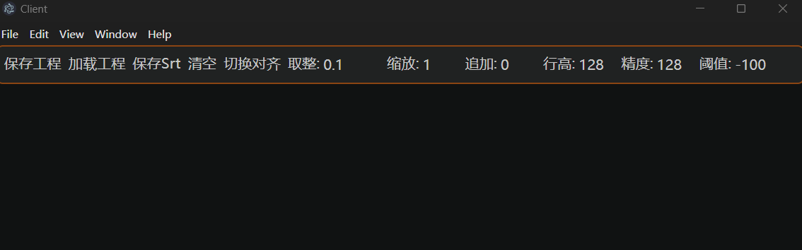
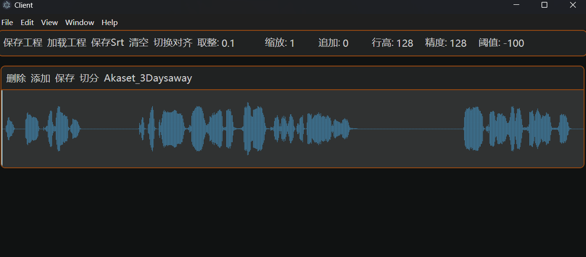
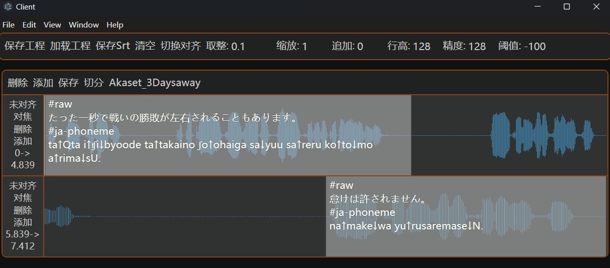
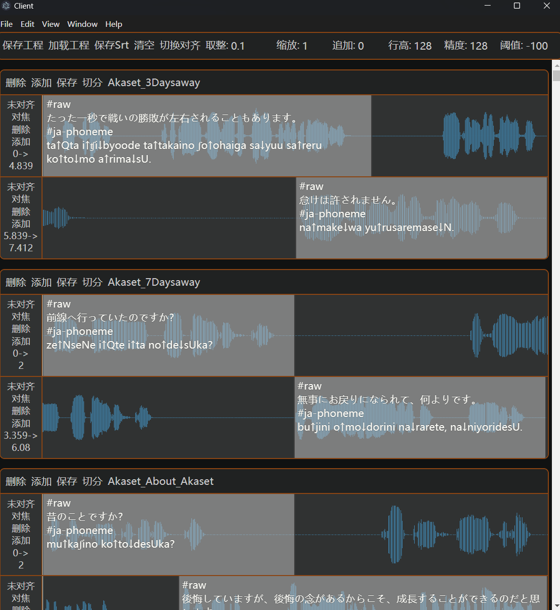

# Audio-Dataset-Studio

一款用于音频波形可视化与 SRT 字幕手动校准的桌面工具。通过直观的波形拖拽操作，精确对齐字幕时间轴。

## 功能特性

- 可视化音频波形，按 SRT 字幕行分段显示
- 拖拽调整字幕时间轴，实时编辑字幕文本
- 相邻行自动衔接对齐
- 自动吸附取整，减少手动微调
- 静音区域过滤，突出有效语音段
- 按 SRT 时间轴切分音频为多个片段

## 支持格式

| 类型 | 格式 |
|------|------|
| 音频 | `.wav`, `.flac` |
| 字幕 | `.srt` |

## 使用方法

### 导入文件

将音频文件和对应的 SRT 字幕文件**直接拖拽到应用窗口**中。文件按文件名自动匹配：

- `audio.wav` + `audio.srt` → 自动配对并加载

### 波形交互操作

每个音频文件加载后会显示为一个独立的波形区域，SRT 的每一行对应一个带时间轴的可交互波形片段。所有操作均通过鼠标完成：

| 操作 | 说明 |
|------|------|
| **鼠标滚轮** | 上下滚动页面（普通滚动条行为） |
| **Shift + 鼠标滚轮** | 鼠标悬停在某一波形上时，前后平移该波形的展示窗口 |
| **Ctrl + 鼠标滚轮** | 先点选某一波形展示栏使其获得焦点，然后按住 Ctrl 滚动即可缩放该波形的显示比例 |
| **单击波形任意位置** | 从点击位置开始播放音频 |
| **再次单击同一波形栏** | 暂停播放 |
| **点击波形上的文字区域** | 进入该行 SRT 字幕文本的编辑模式 |

**调整时间轴：**
- 拖拽波形区域（Region）的**左/右边缘**调整字幕的起止时间
- 拖拽区域中间部分可以**整体平移**时间段

### 工具栏参数

| 参数 | 说明 | 默认值 |
|------|------|--------|
| 取整 | 吸附步长精度（秒）。调整时间轴时自动吸附到此精度的整数倍，设为 0 可关闭 | 0.1 |
| 缩放 | 波形振幅的纵向缩放倍率 | 1 |
| 追加 | 保存 SRT 时，最后一段的结束时间自动延长此时长（秒） | 0 |
| 行高 | 每行波形显示高度（像素） | 128 |
| 精度 | 波形峰值采样精度（1/x），值越大细节越多但占用更多内存 | 128 |
| 阈值 | 静音过滤阈值（dB）。低于此阈值的波形不渲染，-100 表示不过滤 | -100 |

### 行操作面板

每行字幕左侧均有操作按钮：

| 按钮 | 功能 |
|------|------|
| 未对齐/已对齐 | 切换对齐模式。开启后，相邻行首尾紧密衔接，拖动一行会自动调整邻行边界 |
| 对焦 | 重新将波形视图聚焦到当前行的区域 |
| 删除 | 删除当前字幕行 |
| 添加 | 在当前行下方插入新的空白字幕行 |

面板下方实时显示当前行的起止时间。

### 音频操作栏

每个音频文件顶部有操作按钮：

| 按钮 | 功能 |
|------|------|
| 删除 | 从工作区移除该音频 |
| 添加 | 在最后一行下方新增空白字幕行 |
| 保存 | 覆盖保存 SRT 到原文件路径 |
| 切分 | 根据 SRT 时间轴将音频切分为多个片段，输出到音频文件所在目录 |

### 全局操作

| 按钮 | 功能 |
|------|------|
| 保存 Srt | 批量保存所有音频的 SRT 到各自的原始路径 |
| 切换对齐 | 一键切换所有字幕行的对齐状态 |
| 清空 | 清除工作区中的所有音频 |

> ⚠️ **关于「保存工程」与「加载工程」**：这两个按钮目前**未实现**，暂不可用。请使用「保存 Srt」将字幕保存到原文件路径。

### 保存与导出

- **保存 SRT**：点击工具栏的「保存 Srt」，所有修改将覆盖写入各音频对应的原始 SRT 文件
- **切分音频**：点击音频操作栏的「切分」，按每行字幕的时间轴将音频切分为独立片段，文件命名格式为 `{原文件名}_Segment_{序号}{扩展名}`，输出到原音频所在目录

## 界面预览

**初始界面：**



**仅投入音频文件：**



**投入 SRT 完成配对：**



**大量音频与 SRT 加载效果：**



## 开发

### 环境要求

- Node.js
- npm

### 安装与运行

```bash
npm install # 更推荐使用 npm ci 直接安装package-lock
npm start
```

### 构建

```bash
npm run build
```

### 技术栈

- Electron 32 + electron-forge
- React 18 + TypeScript
- MUI 7 + Emotion
- wavesurfer.js 7
- ffmpeg（通过 [@zwa73/audio-utils](https://www.npmjs.com/package/@zwa73/audio-utils)）

### 项目结构

```
src/
├── index.ts                    # Electron 主进程入口
├── preload.ts                  # IPC 桥预加载脚本
├── app.tsx                     # React 应用入口
├── Backend/
│   ├── BridgeBackend.ts        # IPC 后端函数（SRT 解析/生成、文件 IO、音频切分）
│   ├── ProjectData.ts          # 项目数据类型定义
│   └── Util.ts                 # 音频切分逻辑
└── Frontend/
    ├── App.tsx                 # 主界面布局
    ├── AudioToolKit/
    │   ├── AudioToolKit.tsx            # 主容器（文件拖拽、波形管理）
    │   ├── AudioToolKitControlPanel.tsx # 全局工具栏
    │   ├── Util.ts                     # WaveSurfer 初始化与缓存
    │   └── WaveformContainer/
    │       ├── WaveformContainer.tsx    # 单音频波形容器
    │       ├── SrtLineContainer.tsx     # 单行 SRT 波形交互
    │       └── ...ControlPanel.tsx      # 各级操作面板
```

## License

MIT
